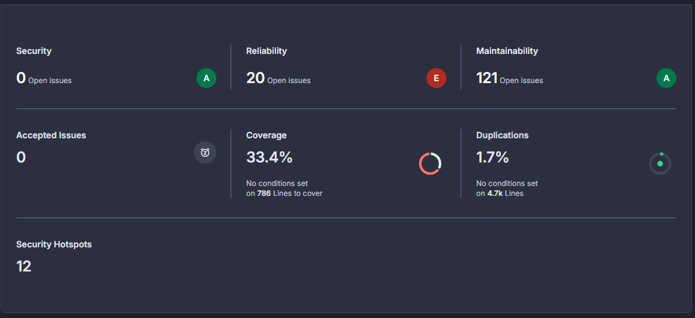

# Sprint 2

## Indicateurs

| Indicateur                        | Début de sprint | Fin de sprint | Évolution |
|-----------------------------------|---------------- |---------------|-----------|
| Nombre de tests                   |       83        |               |           |
| Couverture de code (%)            |      33.4%      |               |           |
| Nombre d’issues (bugs/problèmes)  |       141       |               |           |

## Capture d’écran

